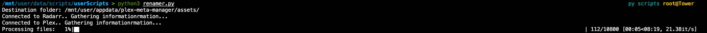

# Renamer
## Overview
These are simple scripts that do not require much. Renamer hooks into your Radarr instance for Movie's names, Sonarr for your TV Show names and Plex for your collection names. 

The script will then parse over a list of posters that you download from sites such as [TPDb](http://www.theposterdb.com). The script will then use a bit of fuzzy matching to determine which file matches to which movie (this is done through the file's name and the movie title). If a match is found that is above the threshold it will then rename the file if needed or move the file to an assets directory. The intent of this script is to be used with the assets directory of Plex Meta Manager as the file's need to be named a certain way for it to pick them up.

I have ran this extensivly on a batch of over 5000 movies and a poster catalog of over 16,000 posters with very very few false posatives with the default thresholds (only 1 that I found to be exact). However your milage my vary,

Few notes: 
1. Please run in dry mode prior to any run to make sure you're not getting any false posatives. 
2. If you'd like to see if your threshold settings are too restrictive you can turn the loggin to INFO and it will give you a what if the score was 5 less.

## Installation/Usage
The script is simple just download the repo:

Fill out the head of the script 
If you need help finding the plex token look [here](https://support.plex.tv/articles/204059436-finding-an-authentication-token-x-plex-token/)

I recommend running all python scripts in a virtual enviroment, documents [here](https://www.google.com/search?client=safari&rls=en&q=virtual+python+enviroment&ie=UTF-8&oe=UTF-8) 
`source /path/to/virtual/enviroment`

Install requirements: 
`pip install -r requirements.txt`

Run script: 
`python /path/to/script/renamer.py`

You should see a progress the script connecting to the service you set up in the head of the script:

Here is an example of what a run would look like:

# Unmatched Posters

## Overview
This is a super simple script that takes your assets directory from PMM and bumps it against your media directory to check what assets your missing. I like to have complete sets of all my posters and have them all matching. This is very helpful to see what all I'm missing.

Note: This will not do collections, in order to do that it would require access to the Plex API, which I did not feel like making. However if somebody requests it i'll seriously consider it.